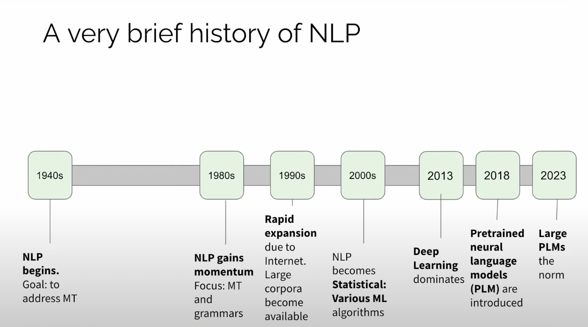
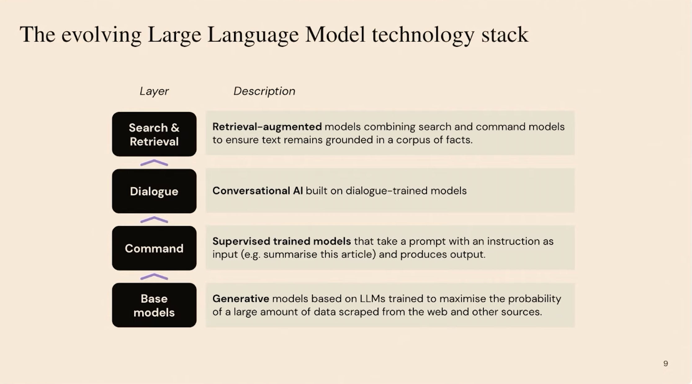

# Exploring foundation models

## Session 1
* *Evidence shows that performance improves with size*
* Paper: *On the Opportunities and Risks of Foundations Models*
* **Intelligence** is a primarily a problem of **data**
* *Completion* from the prompt is not new
* The Turing Test is history
* Products of the models often are more shocking than the model itself
* Most Language Models employ chain rule to decompose joint probability (autoregressive property)
$$P(w_1, ...w_n) = P(w_1)P(w_2|w_1).....P(w_n|w_1,w_2,... w_{n-1})$$
* *human language acquisition partly relies on learning to predict what will come next*

* *Retrieval augmented generation*: Conversational models can be augmented with search results based on the conversation (outside sources)
* not only the training have a high cost, the deployment also has
* Paper: *Survey on KEPLM*

## Session 2
